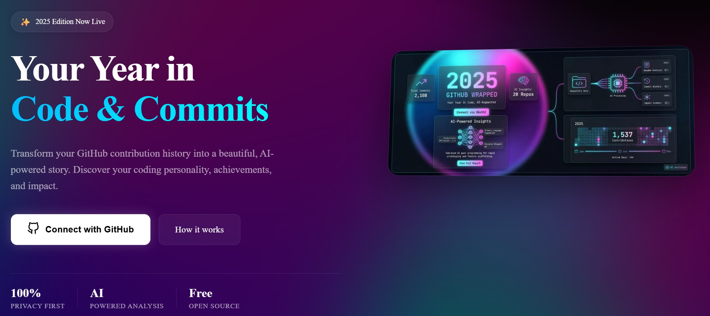
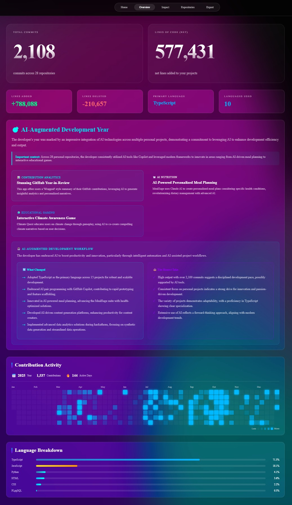
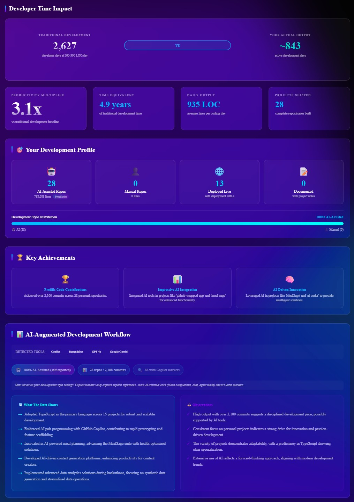
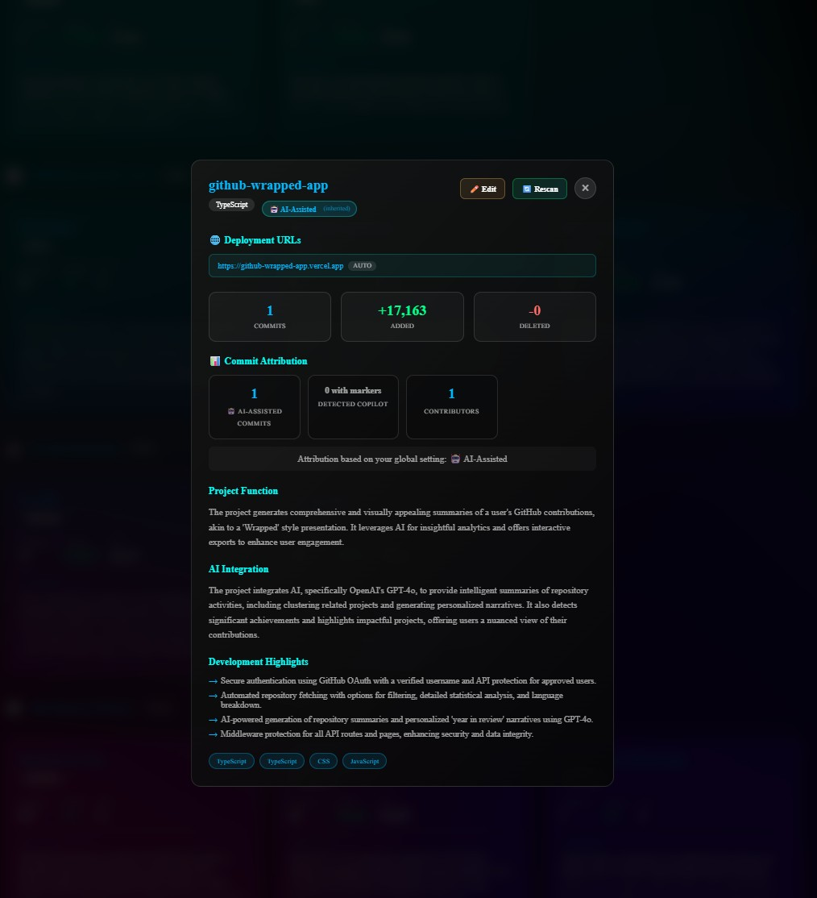

# Automated GitHub Wrapped

An AI-powered, self-service GitHub analytics generator that creates beautiful "Wrapped" style summaries of your GitHub contributions — with smart AI detection, self-reporting, and interactive exports.


## 📸 Screenshots

<p align="center">
  
</p>

<p align="center">
  
  
  
</p>

## ✨ Features

### 🔐 Authentication & Security
- **GitHub OAuth Login** - Secure authentication via GitHub with verified username
- **User Allowlist** - Server-side OpenAI API protection for approved users
- **BYOK (Bring Your Own Key)** - Non-allowlisted users can provide their own OpenAI API key
- **Middleware Protection** - All API routes and pages protected at the middleware level

### 📊 Data Collection & Analysis
- **Automated Repository Fetching** - Pulls all your repositories with filtering options
- **Detailed Statistics** - Commits, LOC (additions/deletions/net), language breakdown
- **Commit Author Analysis** - Detects Copilot agent commits, bot commits, and co-authored commits
- **Contribution Calendar** - Fetches real GitHub contribution heatmap data via GraphQL
- **Organization Detection** - Distinguishes between personal and org repositories

### 🤖 AI-Powered Features
- **Repository Summaries** - GPT-4o generates insightful project descriptions
- **Smart Grouping** - AI clusters related repositories by project family/purpose
- **Year Narrative** - Generates a personalized "year in review" story
- **Achievement Detection** - Identifies standout accomplishments and milestones
- **Featured Projects** - Highlights your most impactful work

### 📝 Self-Reporting System
- **Development Mode** - Set global preference: AI-assisted, Manual, or Mixed
- **Per-Repo AI Flags** - Override global setting for individual repositories
- **Custom Narratives** - Add personal notes/context to any project
- **Custom Groups** - Create your own groupings with custom icons
- **Deployment URLs** - Track live project URLs (auto-detected + manual)

### 🎨 Beautiful UI & Export
- **Glassmorphism Design** - Modern, animated statistics and cards
- **Interactive Wrapped Page** - Tabbed interface with Overview, Impact, and Repositories views
- **Repository Detail Modals** - Deep-dive into any project
- **HTML Export** - Generate self-contained, interactive HTML files
- **Returning User Support** - Remembers preferences and previous analyses

### 🔒 Privacy-First
- **No Permanent Server Storage** - All data processed in-memory
- **LocalStorage Persistence** - Preferences and cached data stay on your device
- **User Controls Data** - Choose which repos to analyze and what to share

## 🚀 Quick Start

See [QUICKSTART.md](./QUICKSTART.md) for detailed setup instructions.

### Prerequisites

- Node.js 18+ and npm
- GitHub account
- OpenAI API key (for AI summaries) OR be on the allowlist

### Installation

```bash
git clone https://github.com/Dan-Co/2025-githubwrapped.git
cd 2025-githubwrapped
npm install
cp .env.example .env
# Edit .env with your credentials
npm run dev
```

Open http://localhost:3000

## 📖 How It Works

1. **Login** - Authenticate with your GitHub account via OAuth
2. **Set Development Mode** - Choose AI-assisted, Manual, or Mixed development style
3. **Select Repos** - Choose which repositories to analyze (with search/filter)
4. **AI Analysis** - AI fetches stats and generates summaries for each repository
5. **Self-Report** - Add narratives, flag AI usage, assign custom groups
6. **Generate Wrapped** - AI creates groupings, achievements, and year narrative
7. **Review & Edit** - Fine-tune summaries in the interactive wrapped page
8. **Export** - Download as self-contained interactive HTML

## 🏗️ Architecture

- **Frontend**: Next.js 14 with React 18
- **Authentication**: NextAuth.js with GitHub OAuth (verified login extraction)
- **GitHub API**: Octokit REST + GraphQL for contribution calendar
- **AI**: OpenAI GPT-4o with structured JSON responses
- **Styling**: CSS Modules with glassmorphism effects
- **Persistence**: LocalStorage for preferences and cached data

See [IMPLEMENTATION_GUIDE.md](./IMPLEMENTATION_GUIDE.md) for detailed architecture documentation.

## 📁 Project Structure

```
2025-githubwrapped/
├── app/
│   ├── api/
│   │   ├── auth/[...nextauth]/  # NextAuth OAuth with login extraction
│   │   └── github/
│   │       ├── analyze/         # AI repository analysis (allowlist protected)
│   │       ├── contributions/   # GitHub GraphQL contribution calendar
│   │       ├── group/           # AI grouping & narrative generation
│   │       ├── repositories/    # List user repositories
│   │       └── stats/           # Detailed repo statistics & author analysis
│   ├── dashboard/               # Repository selection & self-reporting UI
│   ├── wrapped/                 # Final wrapped display with tabs
│   └── page.tsx                 # Landing page
├── components/
│   ├── ApiKeyModal.tsx          # BYOK API key input with validation
│   └── SessionProvider.tsx      # NextAuth session wrapper
├── types/
│   ├── index.ts                 # Core types (repos, preferences, groups)
│   └── next-auth.d.ts           # Extended session types with login
├── utils/
│   ├── preferences.ts           # LocalStorage preference management
│   └── export/
│       ├── styles.ts            # Export CSS generation
│       ├── templates.ts         # HTML template generators
│       └── types.ts             # Export data types
├── docs/
│   └── SELF_REPORTING_IMPLEMENTATION_PLAN.md
├── middleware.ts                # Auth protection for pages & APIs
└── .env.example                 # Environment variables template
```

## 🔑 Environment Variables

See `.env.example` for all required and optional environment variables:

| Variable | Required | Description |
|----------|----------|-------------|
| `GITHUB_CLIENT_ID` | ✅ | GitHub OAuth app client ID |
| `GITHUB_CLIENT_SECRET` | ✅ | GitHub OAuth app client secret |
| `NEXTAUTH_URL` | ✅ | Your app URL (http://localhost:3000 for dev) |
| `NEXTAUTH_SECRET` | ✅ | Random secret for JWT signing |
| `OPENAI_API_KEY` | ⚠️ | OpenAI API key (required for allowlisted users) |
| `ALLOWED_USERS` | ⚠️ | Comma-separated GitHub usernames for server API access |

## 🛡️ Security Model

```
┌─────────────────────────────────────────────────────────┐
│                    Middleware Layer                      │
│  Protects: /dashboard, /wrapped, /api/github/*          │
│  Requires: Valid NextAuth session                        │
└───────────────────────────┬─────────────────────────────┘
                            │
    ┌───────────────────────┼───────────────────────────┐
    │                       │                           │
    ▼                       ▼                           ▼
┌──────────────┐    ┌──────────────┐           ┌──────────────┐
│ GitHub APIs  │    │ OpenAI APIs  │           │ OpenAI APIs  │
│ (stats,repos)│    │ (/analyze)   │           │ (/group)     │
├──────────────┤    ├──────────────┤           ├──────────────┤
│ ✅ Session   │    │ ✅ Session   │           │ ✅ Session   │
│              │    │ ✅ Allowlist │           │ ✅ Allowlist │
│              │    │   OR BYOK    │           │   OR BYOK    │
└──────────────┘    └──────────────┘           └──────────────┘
```

- **GitHub username verified from OAuth** - Not user-editable display name
- **Empty username protection** - Explicitly blocked from allowlist
- **BYOK validation** - User keys validated against OpenAI API before use

## 🚢 Deployment

This app is designed to deploy to Vercel:

1. Push to GitHub
2. Import to Vercel
3. Add environment variables (including `ALLOWED_USERS`)
4. Update GitHub OAuth callback URL to production URL
5. Deploy

See [QUICKSTART.md](./QUICKSTART.md#production-deployment) for detailed deployment instructions.

## 📊 What Gets Analyzed

| Data Point | Source | Description |
|------------|--------|-------------|
| Commit history | GitHub REST API | Count, messages, dates |
| Lines of code | Contributor Stats API | Additions, deletions, net |
| Languages | Repository Languages API | Breakdown by language |
| README content | Repository Contents API | For AI context |
| Contribution calendar | GitHub GraphQL API | Real heatmap data |
| Author analysis | Commit inspection | Copilot/bot detection |
| Organization type | Repository metadata | Personal vs org repos |

All statistics are calculated from real GitHub data - no invented numbers!

## 🤝 Contributing

Contributions welcome! Please:

1. Fork the repository
2. Create a feature branch (`git checkout -b feature/amazing-feature`)
3. Commit your changes (`git commit -m 'Add amazing feature'`)
4. Push to the branch (`git push origin feature/amazing-feature`)
5. Open a Pull Request

## 📝 License

MIT License - see [LICENSE](LICENSE) file for details.

## 🙏 Credits

- **Creator**: [Dan-Co](https://github.com/Dan-Co)
- **AI Assistance**: GitHub Copilot and Claude
- **Inspiration**: Spotify Wrapped and GitHub's annual reports

## 📚 Documentation

- [QUICKSTART.md](./QUICKSTART.md) - Quick setup guide
- [IMPLEMENTATION_GUIDE.md](./IMPLEMENTATION_GUIDE.md) - Detailed architecture and API docs
- [docs/SELF_REPORTING_IMPLEMENTATION_PLAN.md](./docs/SELF_REPORTING_IMPLEMENTATION_PLAN.md) - Self-reporting feature design

## 🐛 Troubleshooting

**OAuth Callback Error**
- Ensure callback URL matches in GitHub OAuth app settings
- Check `NEXTAUTH_URL` is set correctly

**API Key Required (403)**
- You're not on the `ALLOWED_USERS` list
- Provide your own OpenAI API key via the modal
- Or add your GitHub username to `ALLOWED_USERS` env var

**API Rate Limiting**
- GitHub API has 5,000 requests/hour limit
- Consider reducing number of analyzed repositories

**AI Summary Failures**
- Check OpenAI API key is valid
- Verify API quota/credits
- Fallback summaries are used automatically

See [QUICKSTART.md](./QUICKSTART.md#troubleshooting) for more help.

## 🎯 Roadmap

- [ ] PDF export functionality
- [ ] Team/organization analytics
- [ ] Historical comparison (year over year)
- [ ] Custom themes and styling
- [ ] Shareable public wrapped URLs
- [ ] Integration with more AI providers (Claude, Gemini)
- [ ] Database integration for persistent storage

## 💬 Support

- Open an [issue](https://github.com/Dan-Co/2025-githubwrapped/issues)
- Check existing [documentation](./IMPLEMENTATION_GUIDE.md)
- Review [FAQs](./QUICKSTART.md)

---

Made with 💜 and AI assistance by Dan-Co
